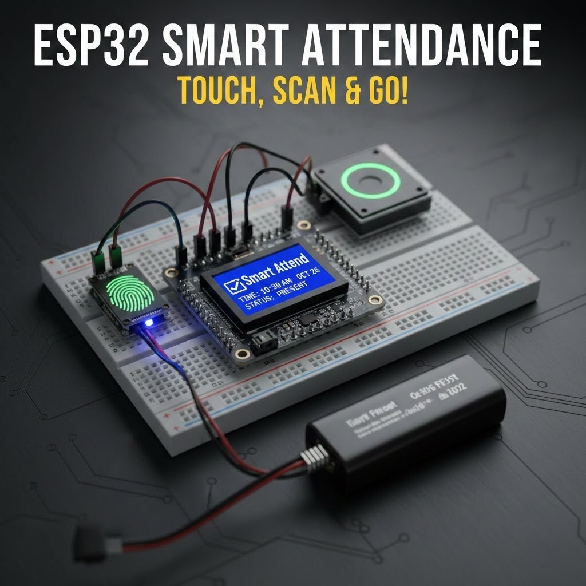

# 📜 RFID Smart Attendance System 📜

An advanced IoT-based attendance and surveillance system built using ESP32 and RFID technology. The system automates attendance tracking, prevents proxy attendance using image verification, sends real-time notifications via Telegram, logs data to Google Sheets, and performs automated report generation and email delivery.

# Overview

The RFID Smart Attendance System is designed to modernize traditional attendance methods by introducing automation, security, and real-time monitoring. Each student is assigned a unique RFID card. When scanned, the system verifies identity, captures an image, logs attendance data, and sends instant notifications.

The system also functions as a live surveillance unit, providing continuous monitoring, effectively combining attendance management and security into a single solution.

# Key Features

- RFID-based attendance system using ESP32
- Real-time Telegram notifications to parents
- Image capture for identity verification
- Prevention of proxy attendance
- Automatic logging to Google Sheets
- Conversion of attendance data into Excel format
- Automated email delivery to admin office
- Live surveillance functionality (acts as CCTV)
- Fully automated workflow with minimal manual intervention

# System Architecture

The system is divided into two main components:

## 1. Embedded System (ESP32)

- Reads RFID card data
- Captures image using camera module
- Sends data to cloud services
- Triggers Telegram notifications

## 2. Cloud Automation Layer

- Stores attendance data in Google Sheets
- Converts data into Excel format
- Sends reports via email automatically
- Manages data processing and automation logic

# Hardware Components

- ESP32 Development Board / ESP32-CAM
- RFID Module (RC522)
- RFID Cards / Tags
- Camera Module (ESP32-CAM or external)
- Power Supply
- Jumper Wires
- Breadboard or PCB

  

 

# Software and Technologies

- Arduino IDE
- Embedded C++
- ESP32 WiFi Library
- Telegram Bot API
- Google Sheets API
- Google Apps Script
- SMTP / Email Automation

# Working Principle

1. Each student is assigned a unique RFID card.
2. When a student scans the card, the ESP32 reads the UID.
3. The system captures an image of the student.
4. Attendance data is sent to a cloud service.
5. The data is logged into Google Sheets automatically.
6. A Telegram notification is sent to the parent with attendance status and image.
7. The data is periodically converted into Excel format.
8. The Excel report is automatically emailed to the admin office.
9. The camera system continuously works as a surveillance unit.

# Telegram Integration

The system uses a Telegram Bot API to send real-time alerts. When a student marks attendance, a message is sent instantly to the parent including:

- Student presence confirmation
- Timestamp
- Captured image for verification

# Google Sheets and Automation

Attendance data is stored in Google Sheets, enabling:

- Real-time cloud storage
- Easy access and monitoring
- Automated report generation

Using Google Apps Script:

- Data is converted into Excel format
- Reports are emailed automatically to administrators

# Applications

- Schools and educational institutions
- Colleges and universities
- Coaching centers
- Office attendance systems
- Secure entry monitoring systems

# Advantages

- Eliminates manual attendance errors
- Prevents proxy attendance
- Provides real-time parent updates
- Automates report generation
- Combines attendance and security in one system
- Reduces administrative workload

# Future Improvements

- Face recognition for enhanced verification
- Mobile app dashboard for admin
- Biometric integration
- Cloud database integration (Firebase)
- Multi-device synchronization
- AI-based attendance analytics

# Project Highlights

- Combines IoT, automation, and security
- Real-world problem-solving system
- Fully automated workflow
- Scalable and adaptable architecture

## Project Difficulty: Difficult Embedded System

## Development Time: 3-4 Weeks

# Author

Embedded Systems Project by Jash.
